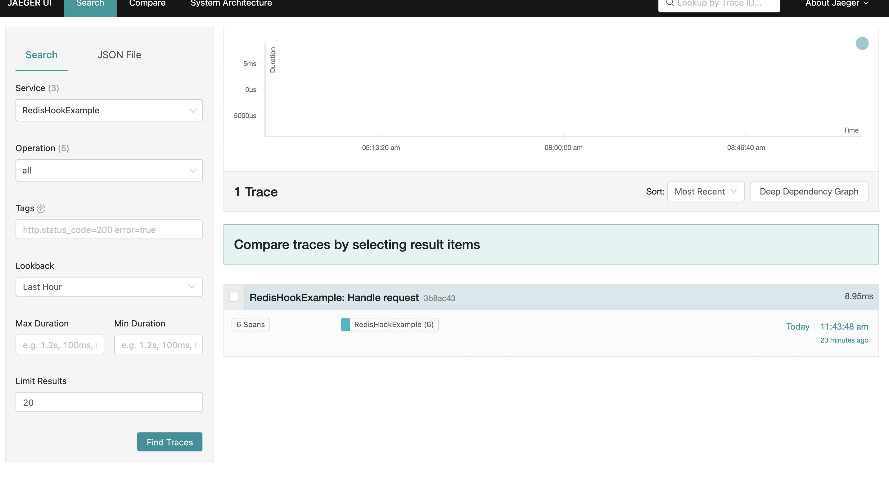
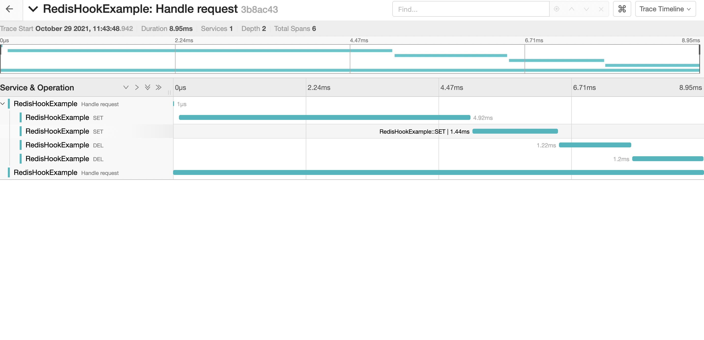

# Example use hook with jaeger
This is a application that integrate opentracing into redis via hook.

## Running

### Run Jaeger backend

An all-in-one Jaeger backend is packaged as a Docker container with in-memory storage.

```bash
docker run \
  --rm \
  --name jaeger \
  -p6831:6831/udp \
  -p16686:16686 \
  jaegertracing/all-in-one:latest
```

### Run Redis
make sure you have a instance redis running on your machine.

### Run Application
go to examples folder then run
` go run jaeger/main.go`


## Link to trace
access from browser via http://localhost:16686
you should see result as the images below.

1. Choose service `RedisHookExample`


2. Discovery a request via span.


